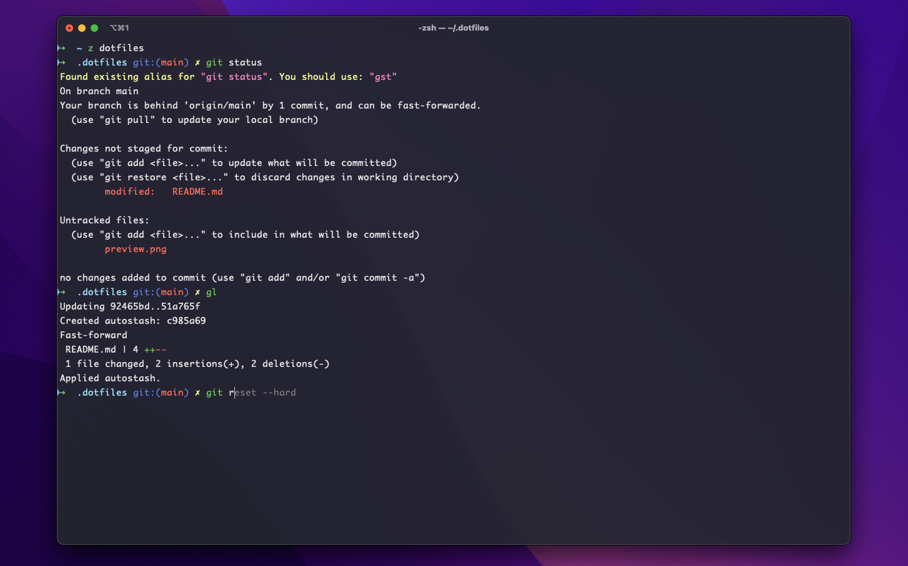

# Dotfiles

A collection of config files and tools to quickly set up a fresh macOS development environment, tailored for a JavaScript developer.

Includes my favorite browsers, code editor, a shiny terminal and a bunch of CLI tools.



## Content

### Essentials

- **Browsers**: [Brave](https://brave.com/), Google Chrome and Firefox.
- **Editor**: [VSCode](https://code.visualstudio.com/) with JavaScript-oriented settings and essential plugins.
- **Terminal**: [iTerm](https://iterm2.com/) with the [oh-my-zsh](https://github.com/ohmyzsh/ohmyzsh) shell and [Dracula](https://draculatheme.com/)-inspired theme.
- **Windows manager**: [Rectangle](https://rectangleapp.com/)
- **Clipboard manager**: [Maccy](https://maccy.app/)

### CLI tools

[GitHub CLI](https://cli.github.com/), [git-open](https://github.com/paulirish/git-open), [n](https://github.com/tj/n), [wget](https://www.gnu.org/software/wget/), [zoxide](https://github.com/ajeetdsouza/zoxide), [ack](https://linux.die.net/man/1/ack), [bat](https://github.com/sharkdp/bat), [thefuck](https://github.com/nvbn/thefuck), [tldr](https://tldr.sh/)

## Installation

### Prerequisites

#### Install Xcode CLI

```sh
xcode-select --install
```

### Clone the Repo

```sh
git clone https://github.com/jarekdanielak/dotfiles.git ~/.dotfiles
```

### Execute Install Script

```sh
bash ~/.dotfiles/install.sh
```

> [!NOTE]  
> Your files are backed up in `~/.dotfiles-backup` directory. See how to [bring it back](#uninstall).

### Set Git User

```sh
git config --global user.name "name"
git config --global user.email "email"
git config --global github.user "username"
```

## Uninstall

Your config is backed up in the `~/.dotfiles-backup` directory.

### Config files

Copy `.zshrc` and `.gitconfig` files back to the home directory.

```sh
cp -f ~/.dotfiles-backup/.zshrc ~/
```

```sh
cp -f ~/.dotfiles-backup/.gitconfig ~/
```

### VSCode Settings

Copy `settings.json` back to VSCode User directory.

```sh
cp -f ~/.dotfiles-backup/settings.json ~/Library/Application\ Support/Code/User/
```

### Homebrew

Bring back your old packages.

```sh
brew bundle cleanup --file='~/.dotfiles-backup/Brewfile' --force
```

### oh-my-zsh

Refare to [uninstalling oh-my-zsh](https://github.com/ohmyzsh/ohmyzsh?tab=readme-ov-file#uninstalling-oh-my-zsh).
